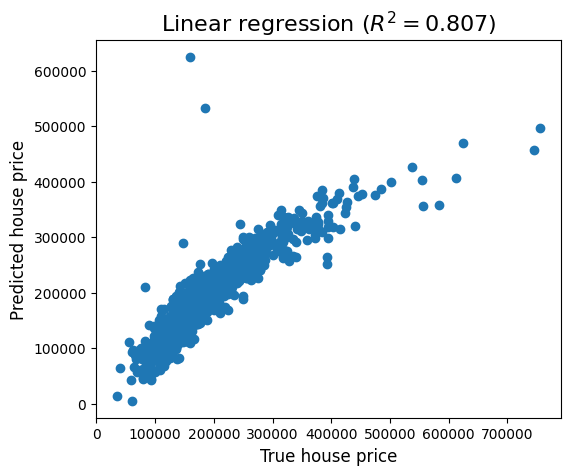

## Data Science Stuff

Datasets:
- House prices dataset (data/house_prices)
    - Exploratory data analysis in data/house_prices/exploratory_data_analysis.ipynb

Correlation matrix for numerical features in the house prices dataset

Predictive models for house price prediction

  
   

