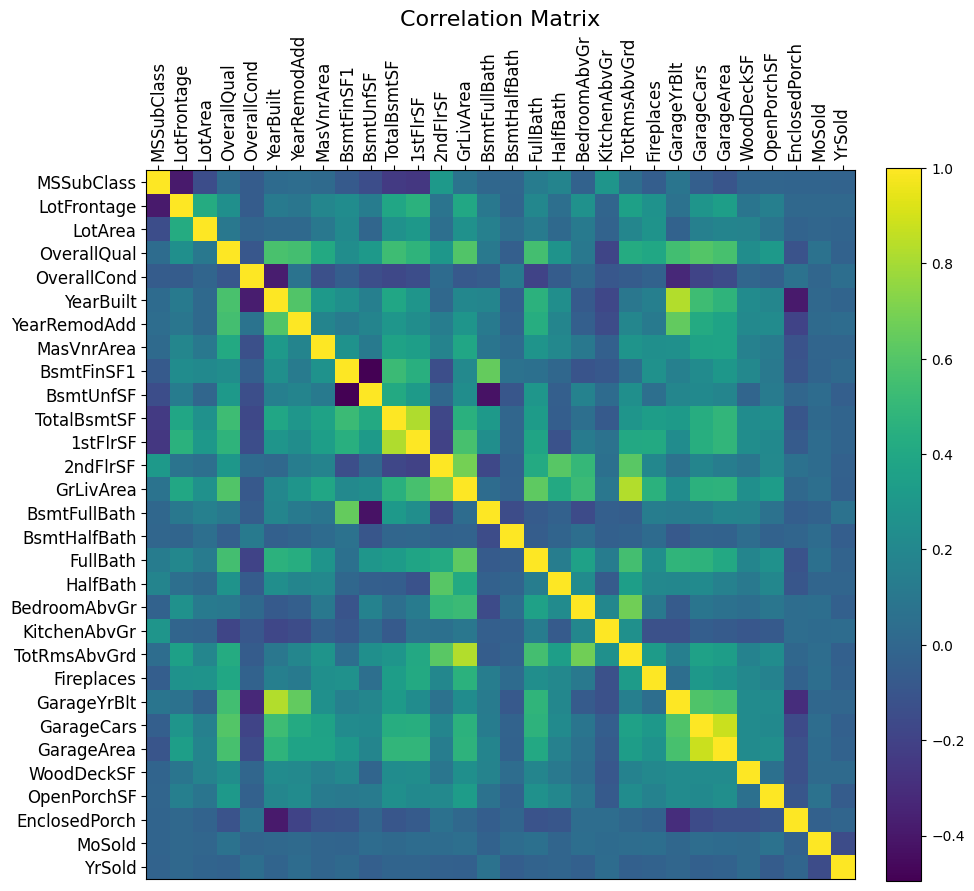

## Data Science Stuff

Datasets:
- House prices dataset (data/house_prices)
    - Exploratory data analysis in data/house_prices/exploratory_data_analysis.ipynb

Correlation matrix for numerical features in the house prices dataset

<<<<<<< HEAD

=======

>>>>>>> 8344b3a4ee8332c6303be4efa1d0d778a11b7e79
